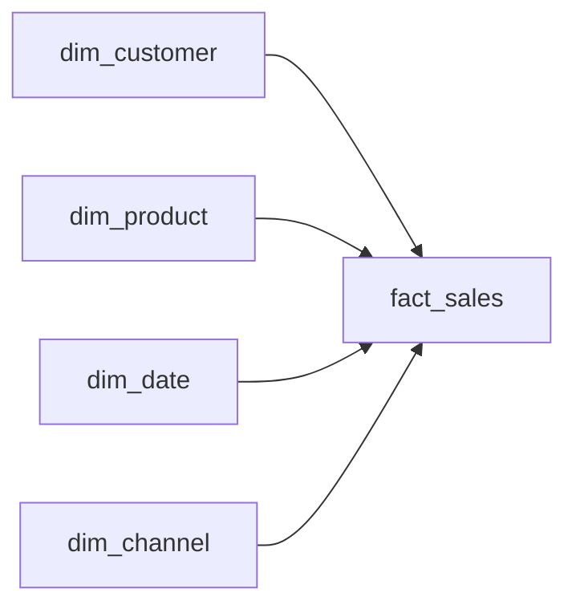

# E-commerce Data Warehouse

<p align="center">
  
  
  
  <a href="https://github.com/dudxzz-25/ecommerce-datawarehouse/actions/workflows/ci.yml"></a>
</p>


[](https://github.com/dudxzz-25/ecommerce-datawarehouse/actions/workflows/ci.yml)

Mini **Data Warehouse em modelo estrela** para análise de vendas. O projeto transforma arquivos operacionais em dimensões e tabela fato, aplica ETL em Python e disponibiliza consultas analíticas em SQL.

## 🎯 Objetivo

Demonstrar a passagem de dados operacionais para uma estrutura dimensional mais adequada a Business Intelligence e análise.

## 🛠️ Stack

**Python · Pandas · SQL · SQLite · ETL · Modelagem Dimensional**

## 🧩 Modelo dimensional



### Dimensões

- `dim_customer`
- `dim_product`
- `dim_date`
- `dim_channel`

### Fato

- `fact_sales`: quantidade, preço unitário, desconto, valor bruto e valor líquido.

## 🔄 Pipeline ETL

```text
CSVs operacionais
      ↓
Pandas
      ↓
Construção de dimensões
      ↓
Geração das surrogate keys
      ↓
Construção da fact_sales
      ↓
SQLite / Star Schema
      ↓
Consultas analíticas
```

## 📂 Estrutura

```text
ecommerce-datawarehouse/
├── data/
│   ├── raw/
│   └── output/
├── scripts/generate_source.py
├── sql/
│   ├── schema.sql
│   └── analytics.sql
├── src/load_dw.py
├── tests/test_dw.py
├── requirements.txt
└── README.md
```

## ▶️ Como executar

```bash
python -m venv .venv
source .venv/bin/activate   # Windows: .venv\Scripts\activate
pip install -r requirements.txt
python scripts/generate_source.py
python src/load_dw.py
sqlite3 data/output/ecommerce_dw.db < sql/analytics.sql
```

### Testes

```bash
python -m unittest discover -s tests -v
```

## 🧠 O que este projeto demonstra

- ETL com Python e Pandas;
- modelagem dimensional e Star Schema;
- surrogate keys;
- tabela fato e dimensões;
- integridade referencial;
- índices para consultas analíticas;
- SQL voltado a métricas de negócio.

## ⚠️ Limitações

O projeto utiliza SQLite e dados sintéticos para manter a execução local simples. Uma evolução natural seria migrar o DW para PostgreSQL ou uma plataforma cloud e adicionar orquestração e cargas incrementais.

---

Desenvolvido por **Eduardo de Toledo Dias**.

[Portfólio](https://dudxzz-25.github.io/portfolio-web/) · [GitHub](https://github.com/dudxzz-25) · [LinkedIn](https://www.linkedin.com/in/eduardo-de-toledo-dias-880b9834b/)